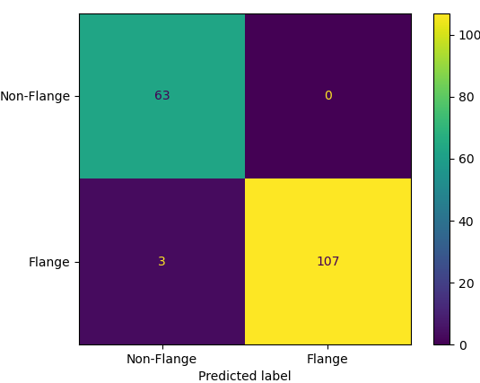

# Flange Detection on Industrial Point Clouds (PointNet++)

This repository contains two pipelines built on **PointNet++** for 3D point clouds of industrial equipment:

1) **Binary Classification (patch-level):** decide whether a 2048-point patch contains a flange or not.  
2) **Semantic Segmentation (point-wise):** label each point as *equipment* or *flange* in full-scene scans.

Both pipelines share a consistent data protocol based on `.ply` files and a reproducible dataset builder that **derives positive (flange) and negative (non-flange) samples** directly from labeled scenes.

## 📌 Quick Links

- [Repository Structure](#repository-structure)
- [Environment & Build](#environment--build)
- [Data Format & Folders](#data-format--folders)
- [Flange Dataset Builder (HDBSCAN)](#flange-dataset-builder-hdbscan)
- [Binary Classification (PointNet2Classifier)](#binary-classification-pointnet2classifier)
- [Semantic Segmentation (PointNet2SemSeg)](#semantic-segmentation-pointnet2semseg)
- [Visualization](#visualization)
- [Where to Put Images](#where-to-put-images)
- [Troubleshooting](#troubleshooting)
- [References](#references)

## Repository Structure

```
.
├─ DATA/                         # Raw .ply scenes (with labels) → used by both tasks
│  ├─ train/*.ply
│  └─ test/*.ply
├─ FLANGE_DATASET/               # Auto-generated by the builder (patches + CSV)
│  ├─ flanges/*.ply              # clustered flange instances (positives)
│  ├─ non_flanges/*.ply          # sampled negatives
│  └─ flange_info.csv            # metadata (centroid, count, label, file path)
├─ models/
│  ├─ equipament_Segmentation_flange/
│  │   └─ pointnet2_equipment_flange_segmentation.py  # PointNet2SemSeg with MSG + Attention + FP
│  └─ flange_classification/
│      └─ pointnet_classification_model_flanges.py    # Binary patch classifier (PointNet2Classifier)
├─ utils/
│  └─ visualization.py           # Inference and visualization utilities
├─ Pointnet2_PyTorch/
│  └─ pointnet2_ops_lib/         # CUDA operations for PointNet++
├─ images/                       # Screenshots/figures for README
│  ├─ confusion_matrix.png
│  ├─ cloudcompare/
│  ├─ output_segmentation/
│  └─ view_flanges/
└─ README.md
```

## Environment & Build

### Prerequisites
* Python ≥ 3.10
* PyTorch 2.4.0+ (CUDA recommended)
* Open3D, HDBSCAN, scikit-learn, torchnet, plyfile, tqdm, matplotlib

### Installation

```bash
# Clone repository
git clone https://github.com/DavCarvalho/pointnet-_industrial_pointcloud_flange_segmentation.git
cd pointnet-_industrial_pointcloud_flange_segmentation

# Install base dependencies
pip install torch torchvision torchaudio --index-url https://download.pytorch.org/whl/cu121
pip install open3d plyfile hdbscan scikit-learn torchnet tqdm matplotlib pandas

# Install pointnet2_ops (CUDA extension)
cd Pointnet2_PyTorch/pointnet2_ops_lib
pip install .
cd ../..
```

## Data Format & Folders

Each raw scene is a `.ply` file with these properties:

* `x, y, z` (float32) — 3D coordinates
* `red, green, blue` — RGB color (0-255)
* `intensity` — Laser return intensity
* `scalar_Classification` **(required)** — labels: `1 = flange`, `0 = equipment/others`

```
DATA/
  train/
    equipment_001.ply
    equipment_002.ply
    ...
  valid/
    ...
  test/
    equipment_Z.ply
```

## Flange Dataset Builder (HDBSCAN)

**Goal:** Build a balanced patch dataset for the binary classifier by **discovering flange instances** and sampling negatives.

### Pipeline

1. **Read .ply** → Load point cloud with labels
2. **Split by ground-truth label** → Extract flanges (label==1) vs equipment (label==0)
3. **Cluster positives with HDBSCAN** → Discover individual flange instances
   * `min_cluster_size=5`
   * Size filter: keep clusters with `>= 500 points`
   * Ignore noise label `-1`
4. **Export positives**: Each cluster → `FLANGE_DATASET/flanges/<equip>_flange_<k>.ply`
5. **Export negatives**: Random chunks of `~15000 points` → `FLANGE_DATASET/non_flanges/`
   * Limit to `15 instances` per equipment
6. **Index CSV** (`flange_info.csv`): equipment, id, point count, centroid, file path, label
7. **Stratified split** ensures balanced train/val/test sets

### Key Functions

* `load_ply(file)` — Load PLY with properties
* `extract_flanges(coords, labels)` — Split by label
* `cluster_flanges_hdbscan(points, min_cluster_size)` — HDBSCAN clustering
* `save_ply(filename, coords, features)` — Save PLY
* `process_equipment(file_path)` — Main processing loop
* `main_data_processing()` — Batch process all equipment

**Figure:**

*Blue = equipment; Orange/Red = flanges (HDBSCAN clusters)*

## Binary Classification (PointNet2Classifier)

**Task:** Given a 2048-point patch, classify as **Flange** or **Non-Flange**.

### Architecture

```
Input: [B, N=2048, 3] normalized XYZ coordinates

SA1: PointNetSetAbstraction
  ├─ FPS sampling: 512 points
  ├─ Radius: 0.2, nsample: 32
  └─ MLP: [64, 64, 128]

SA2: PointNetSetAbstraction
  ├─ FPS sampling: 128 points
  ├─ Radius: 0.4, nsample: 64
  └─ MLP: [128, 128, 256]

SA3: PointNetSetAbstraction (Global)
  ├─ Global pooling (all points)
  └─ MLP: [256, 512, 1024]

Classifier Head:
  FC(1024 → 512) → BN → ReLU → Dropout(0.4)
  FC(512 → 256) → BN → ReLU → Dropout(0.4)
  FC(256 → 2) → Softmax

Output: [B, 2] class probabilities
```

### Training Details

* **Dataset:** Built from `FLANGE_DATASET/flange_info.csv`
* **Sampler:** WeightedRandomSampler for class balance
* **Loss:** CrossEntropyLoss with class weights `[1.0, ratio]`
* **Augmentation (flange only):** 
  - Random jitter (σ=0.01)
  - Random Z-axis rotation
  - Random scaling (0.8-1.25)
* **Hyperparameters:**
  - Epochs: 200
  - Learning rate: 5e-4
  - Batch size: 16
  - Optimizer: Adam
  - Scheduler: StepLR(step_size=20, gamma=0.5)

### Usage

```bash
# Train classification model
python models/flange_classification/pointnet_classification_model_flanges.py

# Model saved to: best_pointnet2_model.pth
```

**Visualization:** Open3D displays predictions (Red=Flange, Blue=Non-Flange)


## Semantic Segmentation (PointNet2SemSeg)

**Task:** Point-wise semantic labels for full scenes (Equipment vs Flange).

### Input Features

We assemble **11-channel** input features:

* **XYZ** (3) — 3D coordinates
* **RGB** (3) — Normalized colors
* **Intensity** (1) — IQR-normalized intensity
* **Normals** (3) — Estimated with Open3D
* **Curvature** (1) — Local geometric curvature (k-NN variance)

### Architecture

```
Input: xyz [B, N, 3] + features [B, 8, N]

┌─────────────────────────────────────────┐
│          ENCODER (Set Abstraction)       │
├─────────────────────────────────────────┤
│ SA1 (Multi-Scale Grouping - MSG)        │
│   ├─ npoint: 2048                       │
│   ├─ radii: [0.1, 0.2]                 │
│   ├─ nsamples: [32, 64]                │
│   └─ MLPs: [[8,64,64,128], [8,64,96,128]]│
│   → Output: 2048 pts, 256 features      │
├─────────────────────────────────────────┤
│ SA2 (Multi-Scale Grouping)              │
│   ├─ npoint: 512                        │
│   ├─ radii: [0.2, 0.4]                 │
│   ├─ nsamples: [64, 128]               │
│   └─ MLPs: [[256,128,128,256], ...]    │
│   → Output: 512 pts, 512 features       │
├─────────────────────────────────────────┤
│ SA3 (Single-Scale)                      │
│   ├─ npoint: 128                        │
│   ├─ radius: 0.8, nsample: 256         │
│   └─ MLP: [512, 256, 512, 1024]        │
│   → Output: 128 pts, 1024 features      │
└─────────────────────────────────────────┘

┌─────────────────────────────────────────┐
│         ATTENTION MECHANISM              │
├─────────────────────────────────────────┤
│ Conv1d(1024 → 512) → BN → ReLU          │
│ Conv1d(512 → 1) → Sigmoid               │
│ → Weighted features                      │
└─────────────────────────────────────────┘

┌─────────────────────────────────────────┐
│     DECODER (Feature Propagation)        │
├─────────────────────────────────────────┤
│ FP3: MLP[1536, 512, 512] → 512 pts      │
│ FP2: MLP[768, 256, 256] → 2048 pts      │
│ FP1: MLP[267, 128, 128] → 8192 pts      │
└─────────────────────────────────────────┘

Classifier:
  Conv1d(128 → 128) → BN → ReLU → Dropout(0.5)
  Conv1d(128 → num_classes)

Output: [B, N, 2] per-point predictions
```

### Custom Loss Function

To handle severe class imbalance (Equipment:Flange ≈ 50:1), we use:

```python
L_total = L_focal + L_dice + L_boundary

Components:
  L_focal: Focal Loss (α=[1.0, 50.0], γ=2.0) - focuses on hard examples
  L_dice: Dice Loss - smooth overlap measure
  L_boundary: Boundary-weighted CE (2x weight near class transitions)
```

### Training Details

* **Class weights:** `[1.0, 50.0]` (adjustable per dataset)
* **Hyperparameters:**
  - Epochs: 100
  - Learning rate: 1e-3
  - Weight decay: 1e-4
  - Batch size: 8
  - Optimizer: Adam
  - Scheduler: StepLR(step_size=20, gamma=0.5)
* **Early stopping:** Patience = 20 epochs
* **Metrics:** Overall Accuracy (OA), mean IoU (mIoU), per-class IoU

### Usage

```bash
# Train segmentation model
python models/equipament_Segmentation_flange/pointnet2_equipment_flange_segmentation.py

# Model saved to: pointnet222improved2_model_<project>.pth
# Metrics saved to: metrics_pointnet222improved2_<project>.csv
```

**Stratified Sampling:** Ensures ≥40% flange points per batch when available.


## Visualization

### Classification Visualization
```python
visualize_prediction(model, dataset, idx)
```
* Red: Predicted Flange
* Blue: Predicted Non-Flange

### Segmentation Visualization
```python
tile_prediction(tile_name, model, PCC, Visualization=True)
```
* Red: Flange points
* Blue: Equipment points

### Utility Script
```bash
python utils/visualization.py
```

Processes all `.ply` files in `DATA/inference/` and displays predictions in Open3D.

## Results

### Segmentation Performance

| Metric | Equipment | Flange | Overall |
|--------|-----------|--------|---------|
| IoU    | XX.XX%    | XX.XX% | XX.XX%  |
| Precision | XX.XX% | XX.XX% | XX.XX%  |
| Recall | XX.XX%    | XX.XX% | XX.XX%  |
| F1-Score | XX.XX%  | XX.XX% | XX.XX%  |

**Confusion Matrix:**



### Visual Results

**Dataset Examples:**


**Segmentation Output:**


## Where to Put Images

Create image directories and add your figures:

```
images/
  ├─ pipeline_overview.png        # Overall dataset builder diagram
  ├─ architecture_diagram.png     # PointNet++ architecture
  ├─ classification_examples.png  # Patch classification results
  ├─ confusion_matrix.png         # Confusion matrix (✓ exists)
  ├─ cloudcompare/                # Scene visualizations
  ├─ output_segmentation/         # Segmentation results
  └─ view_flanges/                # Individual flange examples
```

### Recommended Image Specifications
* Format: PNG
* Max width: 1600px
* DPI: 150-300 for diagrams

### Markdown Embed Examples
```markdown

*Dataset builder: HDBSCAN clustering of flange instances*


*PointNet++ with Multi-Scale Grouping and Attention*
```

## Reproducibility Notes

* **Normalization:** Each point cloud is centered at origin and scaled to unit sphere
* **Augmentation:** Applied only during training
  - Classification: jitter, Z-rotation, scaling
  - Segmentation: rotation, jitter, scale, shuffle
* **Random seeds:** Not fixed in current version - log them for exact reproduction
* **HDBSCAN:** Deterministic given fixed parameters and seed

## Troubleshooting

### `ImportError: pointnet2_ops`
**Solution:** Ensure CUDA toolkit matches PyTorch build. Rebuild from source:
```bash
cd Pointnet2_PyTorch/pointnet2_ops_lib
python setup.py install
```

### No `scalar_Classification` in .ply
**Solution:** The dataset builder requires this property. Ensure your PLY files include labeled points.

### HDBSCAN finds only noise
**Solutions:**
* Lower `min_cluster_size` (try 3-5)
* Increase `min_points_flange` threshold
* Check point cloud density

### Class collapse / poor mIoU
**Solutions:**
* Increase class weight for flange (try 75.0-100.0)
* Use stratified sampling (already implemented)
* Add more data augmentation
* Adjust focal loss α parameter

### CUDA out of memory
**Solutions:**
* Reduce `batch_size` (try 4 or 2)
* Reduce `subsample_size` (try 4096)
* Use gradient accumulation

### Windows long path issues
**Solution:** Keep dataset paths short (e.g., `C:\pc\DATA`)

## Key Functions Reference

### Dataset Builder
* `load_ply(filename)` — Load PLY file
* `extract_flanges(coords, labels)` — Separate flanges from equipment
* `cluster_flanges_hdbscan(points, min_cluster_size)` — Cluster flanges
* `compute_geometric_features(coords)` — Calculate normals and curvature
* `save_ply(filename, coords, features)` — Save PLY file

### Classification
* `PointNet2Classifier` — Binary classification model
* `PointNetSetAbstraction` — Set abstraction layer
* `train_model()` — Training loop
* `visualize_prediction(model, dataset, idx)` — Visualize predictions

### Segmentation
* `PointNet2SemSeg` — Semantic segmentation model
* `PointnetSAModuleMSG` — Multi-scale grouping
* `PointnetFPModule` — Feature propagation
* `custom_flange_loss()` — Combined loss function
* `train_full(args, device)` — Full training pipeline
* `tile_prediction()` — Inference on full scenes

## References

### Papers
* **PointNet++:** Qi et al., "PointNet++: Deep Hierarchical Feature Learning on Point Sets in a Metric Space", NeurIPS 2017
* **HDBSCAN:** Campello et al., "Hierarchical Density Estimates for Data Clustering, Visualization, and Outlier Detection", ACM TKDD 2015
* **Focal Loss:** Lin et al., "Focal Loss for Dense Object Detection", ICCV 2017

### Code
* Original PointNet2 PyTorch: [erikwijmans/Pointnet2_PyTorch](https://github.com/erikwijmans/Pointnet2_PyTorch)

## Citation

If you use this code in your research, please cite:

```bibtex
@software{pointnet2_flange_segmentation,
  author = {Carvalho, David},
  title = {PointNet++ Industrial Point Cloud Flange Segmentation},
  year = {2025},
  url = {https://github.com/DavCarvalho/pointnet-_industrial_pointcloud_flange_segmentation}
}
```

## License

This project is licensed under the MIT License.

## Contact

For questions or collaborations:
* Open an issue on GitHub
* Contact: [@DavCarvalho](https://github.com/DavCarvalho)

---

**Status:** 🚧 Active Development | **Last Updated:** November 2025

**Key Features:**
✓ HDBSCAN-based flange instance discovery
✓ Balanced dataset generation
✓ Custom loss for extreme class imbalance
✓ Multi-scale feature extraction
✓ Attention mechanism for segmentation
✓ Comprehensive visualization tools